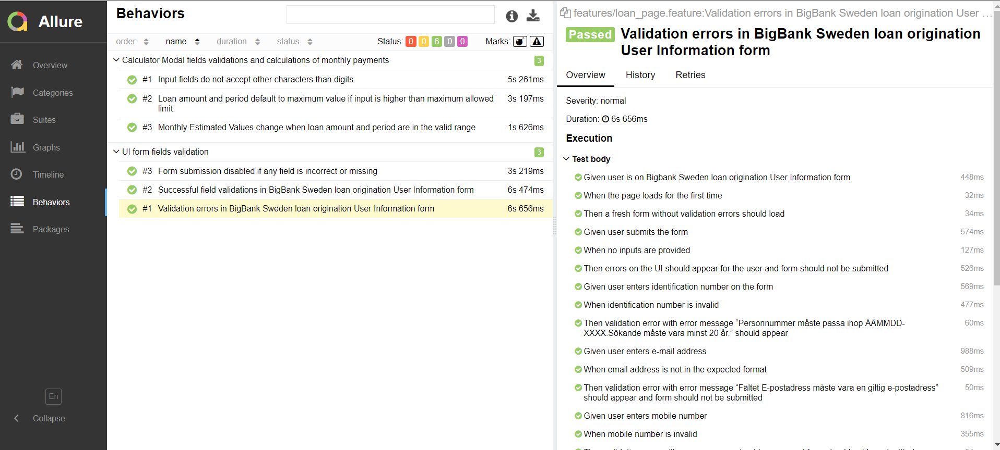
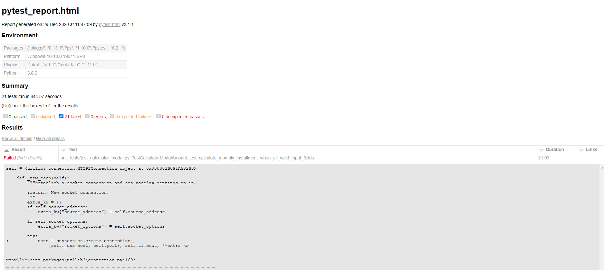

# BigBank Sweden Loan Page and calculator modal testing
## Pre-requisites needed to run the test suite:
1. Python environment (Python 3.8 +)
2. IDE (Pycharm)
3. venv (virtual environment in Python)
4. allure - https://docs.qameta.io/allure/

##Project structure

Python behave needs a certain directory structure for the testing of the feature files. The below structure explains the 
directory structure for the project

* /framework - contains webapp.py which is responsible for initializing the selenium web driver for chrome
* /pages - responsible for loading the UI pages that would be tested. For our use case the link is https://ansokan.bigbank.se/
* /features - contains the feature files which are written in Gherkin. Also contains envrironment.py that consists of methods 
  needed for initialization and de-initialization
* /features/steps - contains the .py files that have steps definition and their implementation. The steps file correspond 
  to their respective feature files.
  
## Test execution

Assuming that the Python IDE and setup is ready. You can now create venv

```shell
python -m venv venv
```
activate venv
```shell
# for windows
venv\Scripts\activate
# for mac/linux
source venv/bin/activate
```

install the package that are part of the project

```shell
pip install -r requirements.txt
```

### Browser/UI testing using Behave


```shell
behave -f allure_behave.formatter:AllureFormatter -o reports
```
the above command creates the report under the folder reports. The reports can be viewed either in JSON format or served
using allure. 
If you have installed allure as mentioned in pre-requisite, run the below command

```shell
allure serve reports
```



### Unit tests for Calculate API

```shell
pytest -v unit_tests/test_calculator_modal.py --html=pytest_report.html --self-contained-html
```
The above command will generate a html report in the root folder with the name `pytest_report.html` which can be viewed on any browser.



_**NOTE: Most of the test cases fail for calculate API since the logic for calculating APRC and monthly installments is unknown to 
the tester at the time. The test cases were passing at one moment of the day and the next day they failed as the 
monthly installments and total repayable amount changed.**_

